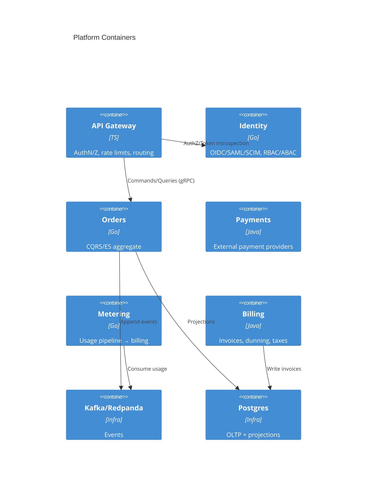

# C4: Container Diagram

```mermaid
C4Container
  title Platform Containers
  Container(gateway, "API Gateway", "TS", "AuthN/Z, rate limits, routing")
  Container(identity, "Identity", "Go", "OIDC/SAML/SCIM, RBAC/ABAC")
  Container(orders, "Orders", "Go", "CQRS/ES aggregate")
  Container(payments, "Payments", "Java", "External payment providers")
  Container(metering, "Metering", "Go", "Usage pipeline → billing")
  Container(billing, "Billing", "Java", "Invoices, dunning, taxes")
  Container(eventbus, "Kafka/Redpanda", "Infra", "Events")
  Container(db, "Postgres", "Infra", "OLTP + projections")
  Rel(gateway, identity, "AuthZ/Token introspection")
  Rel(gateway, orders, "Commands/Queries (gRPC)")
  Rel(orders, eventbus, "Append events")
  Rel(orders, db, "Projections")
  Rel(metering, eventbus, "Consume usage")
  Rel(billing, db, "Write invoices")
```
