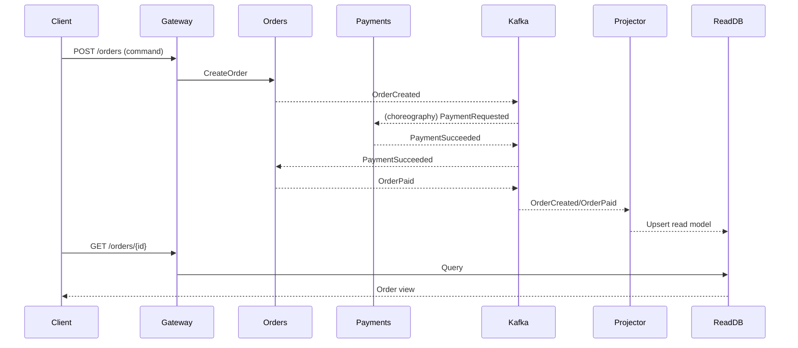

# Orders Vertical Slice

```mermaid
sequenceDiagram
  participant Client
  participant Gateway
  participant Orders
  participant Payments
  participant Kafka
  participant Projector
  participant ReadDB

  Client->>Gateway: POST /orders (command)
  Gateway->>Orders: CreateOrder
  Orders-->>Kafka: OrderCreated
  Kafka-->>Payments: (choreography) PaymentRequested
  Payments-->>Kafka: PaymentSucceeded
  Kafka-->>Orders: PaymentSucceeded
  Orders-->>Kafka: OrderPaid
  Kafka-->>Projector: OrderCreated/OrderPaid
  Projector-->>ReadDB: Upsert read model
  Client->>Gateway: GET /orders/{id}
  Gateway->>ReadDB: Query
  ReadDB-->>Client: Order view
```
