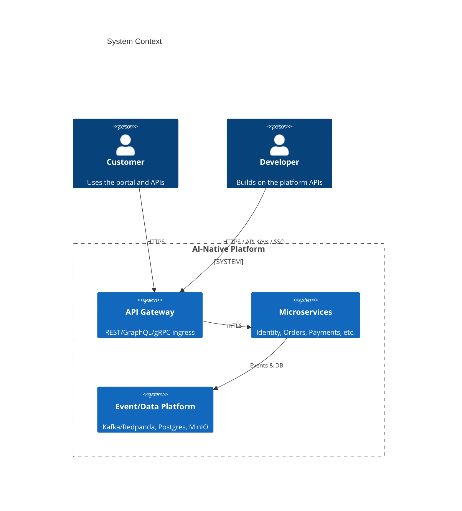

# C4: System Context

```mermaid
C4Context
  title System Context
  Person(customer, "Customer", "Uses the portal and APIs")
  Person(dev, "Developer", "Builds on the platform APIs")
  System_Boundary(p, "AI-Native Platform") {
    System(gw, "API Gateway", "REST/GraphQL/gRPC ingress")
    System(svcs, "Microservices", "Identity, Orders, Payments, etc.")
    System(data, "Event/Data Platform", "Kafka/Redpanda, Postgres, MinIO")
  }
  Rel(customer, gw, "HTTPS")
  Rel(dev, gw, "HTTPS / API Keys / SSO")
  Rel(gw, svcs, "mTLS")
  Rel(svcs, data, "Events & DB")
```
